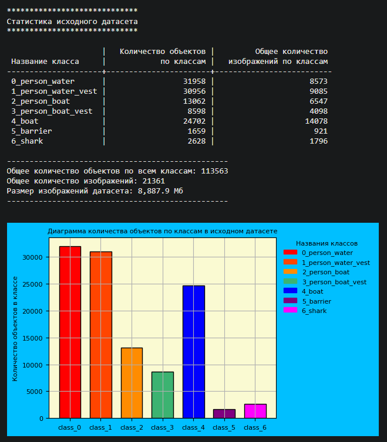
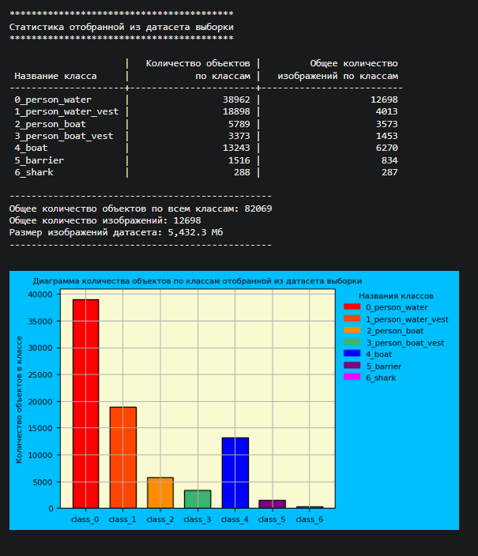
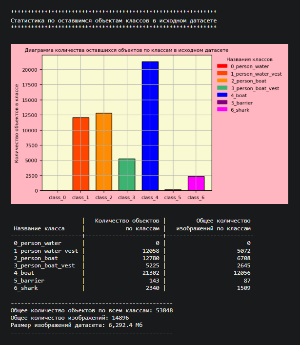
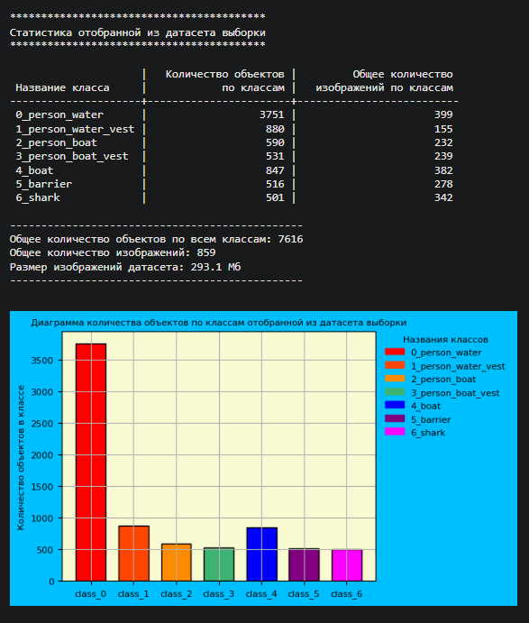

# Описание балансирующего парсера для манипуляции с датасетом Yolo

Балансирующий парсер работает с датасетами формата Yolo, выполнен в виде класса, экземпляр которого создается для каждого конкретного датасета в формате Yolo. Парсер манипулирует количеством объектов в классах датасета и позволяет:

1. Извлекать из датасета выборку у которой количество объектов на каждый класс не ниже заданного порога и максимально приближено к данному порогу;
2. Извлекать из датасета выборку у которой для каждого класса задан свой отдельный порог по количеству объектов. Т.е. в виде списка задается порог по количеству объектов на каждый класс для извлекаемой выборки. Парсер отбирает такую комбинацию аннотаций для формируемой выборки, чтобы выборка по количеству объектов на класс была не ниже и максимально возможно приближена к заданному пороговому значению по количеству объектов на класс.
3. Полностью удалить из датасета один или несколько классов и увидеть статистику результирующего датасета с удаленным классом(ами).
4. Отображает статистику датасета и формируемых выборок выборок, которая показывает:
    - количество объектов по каждому классу в датасете или сформированной выборке;
    - количество изображений по каждому классу в датасете или сформированной выборке;
    - общее количество объектов по всем классам, общее количество изображений по всем классам;
    - размер в Мегабайтах изображений исходного датасета, сформированной выборки, оставшейся в исходном датасете выборке;
5. Может использоваться для того, чтобы отобрать из одного датасета выборку с заданными порогами по количеству объектов на каждый класс, для того, чтобы потом добавить эту выборку в другой датасет.
6. Имеет режим анализа (когда он не осуществляет копирования файлов аннотаций отобранной выборки) в котором парсер применяется для анализа датасета. В данном режиме он позволяет увидеть какая выборка получится и что останется в исходном датасете, если из него отобрать ту или иную выборку, либо удалить вообще тот или иной класс(ы).
7. Запоминает состояние по отобранным ранее файлам и позволяет делать разные выборки из одного и того же датасета в которых не будут повторяться файлы датасета, ранее отобранные парсером в предыдущую сделанную выборку. Это позволяет из одного датасета получить несколько максимально возможно сбалансированных выборок, либо стратифицированных выборок с предельно одинаковым соотношением по количеству объектов на класс в каждой как в исходном датасете, что полезно когда датасет большой и модель нужно будет обучать частями (вручную так датасет никогда не разделить). При этом статистика на втором графике будет отражать при каждом очередном отборе сколько по каждому классу можно еще отобрать из исходного датаста (т.е. сколько еще можно отобрать среди неотобранных файлов аннотаций).
8. Начал так же реализовывать функционал оверсамплинга парсером минорных и мизерных классов при формировании выборки, пока в разработке, работает пока только в режиме анализа.
9. Можно выявлять неравномерности и перекосы в распределении данных в датасете, пример такого применения показан в прилагаемом на GitHub ноутбуке.
10. Периодически обнаруживаю новые востребованные способы применения данного парсера для манипуляциями с датасетами для компьютерного зрения, сам не ожидал, что вещь по факту окажется реально полезной в практическом плане.

Создание экземпляра парсера:

Парсер выполнен в виде класса DatasetBalanceParser(). Для создания экземпляра класса в него необходимо подать список с именами классов, путь к папке с аннотациями датасета в формате Yolo, путь к папке с изображениями. 
__init__(self, classes_names_list, source_annotations_path, source_images_path)

Основные методы, необходимые для работы парсера:

source_dataset_info() - выведет статистику исходного датасета, описанную в п. 4.
Параметров не имеет, вывод метода:
    - таблица статистики по оставшемуся в исходном датасете количеству объектов, доступных для дальнейшего отбора, после произведенной выборки.
    - столбчатая диаграмма по количеству объектов по классам оставшихся в исходном датасете и доступных для дальнейшего отбора.
Пример вывода методом статистики исходного датасета:

get_balanced_samples(class_objects_threshold, target_annotations_path, initial_avoid_file_names_list=None, keep_avoided=True, analysys_mode=False, oversampling_classes=[])

Это основной применяемый метод для формирования выборок из датасета. Данный метод отбирает выборку аннотаций из датасета с количеством объектов на каждый класс не ниже, но максимально насколько возможно приближенную к указанному в class_objects_threshold порогу по кол-ву объектов по каждому классу и копирует аннотации отобранной выборки в папку target_annotations_path. 
ПРИМЕЧАНИЕ:
В не зависимости от значения порога, при формировании выборки парсер отбирает аннотации из исходного датасета для каждого класса равномерно по всей выборке от ее начала, до конца, генерируя для отбора индексы аннотаций, содержащие нужный класс разной степени разряженности, в зависимости от порога. Т.е. в не зависимости от порога выборка всегда репрезентативна и отражает исходный датасет.

Параметры:
class_objects_threshold - int или list. Определяет порог по количеству объектов на каждый класс не ниже которого и максимально приближенно к которому парсер отберет комбинацию аннотации, чтобы получилась требуемая выборка.

target_annotations_path - папка, в которую парсер сохранит аннотации отобранной выборки

initial_avoid_file_names_list - список имен файлов аннотаций датасета, которые парсер не будет затрагивать при формировании датасета

keep_avoided - булевый параметр, определяет запоминать ли парсеру ранее отобранные файлы, чтобы при последующих отборах не использовались ранее отобранные выборки. Если требуется отбирать из датасета выборки далее, то keep_avoided должно быть True. Если же нужно экспериментировать с разными вариациями (в т.ч. в режиме анализа) и делать отбор каждый раз заново, то keep_avoided должно быть False.

analysys_mode - переводит парсер в режим анализа, копирование файлов аннотаций отобранной выборки не происходит, но парсер в выводе начинает показывать, что будет если отобрать ту или иную выборку из датасета. Можно в этом режиме работать как при keep_avoided=True для того, чтобы посмотреть, что будет и что останется, если отобрать несколько выборок, так и когда keep_avoided=False, если нужно поэкспериментировать. На розовом же графике при параметре keep_avoided=False будет всегда показываться статистика исходного датасета, т.к. парсер не запоминает отобранные файлы.

oversampling_classes=[] - классы, аннотации по которым нужно размножать в режиме оверсамплинга, предназначен для минорных и мизерных классов, функционал пока в разработке.

Вывод метода:
    - прогресс-бар копирования отобранных для сформированной выборки файлов аннотаций в target_annotations_path.
    - таблица статистики по отобранной выборке в соответствии с заданными порогами в class_objects_threshold.
    - столбчатая диаграмма по количеству объектов по классам отобранной выборки.
    - таблица статистики по оставшемуся в исходном датасете количеству объектов, доступных для дальнейшего отбора, после произведенной выборки.
    - столбчатая диаграмма по количеству объектов по классам оставшихся в исходном датасете и доступных для дальнейшего отбора. 

Пример полного удаления класса из исходного датасета.

На графике показана выборка, содержащая все аннотации с классом class_0 и сопутствующие классы, которая подлежит полному удалению из датасета:

На графике показана статистика датасета, после удаления из него всех файлов, содержащих удаляемый из датасета класс class_0:

Пример отбора из выборки с порогом в 500 объектов для каждого класса:

На графике показана выборка с порогом 500 объектов по каждому классу (возможная комбинация по объектам в такой выборке).
class_0 ушел в дисбаланс и в количестве более 3500 объектов, как самый мажорный и часто встречающийся класс объектов на каждом изображении, его дисбаланс соответствует допущениям, заложенными в алгоритме отбора, т.к. для данного датасета это максимально возможно близкая комбинация к пороговым значениями.
Все остальные классы получились по возможности предельно близкими к порогу в 500 объектов на класс. 

reset_avoided() - метод для обнуления хранящегося в классе списка имен с уже отобранными файлами, бывает нужен как в рабочем режиме, так и в режиме анализа, когда нужно начинать отбор с самого начала.

В ноутбуке с кодом парсера на GitHub приведено больше примеров использования парсера, описанных в списке выше с описанием возможностей парсера.

